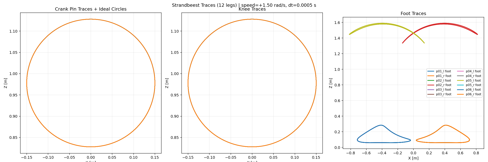
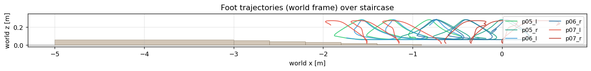
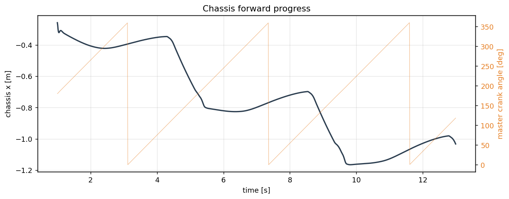
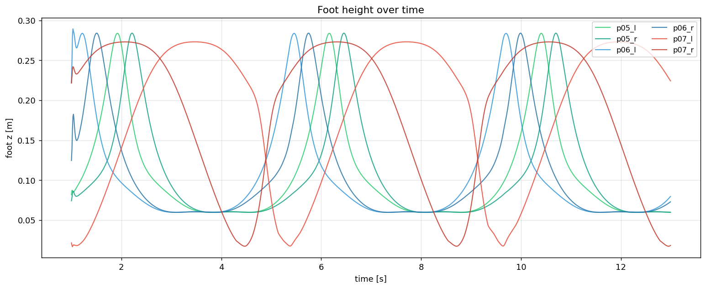
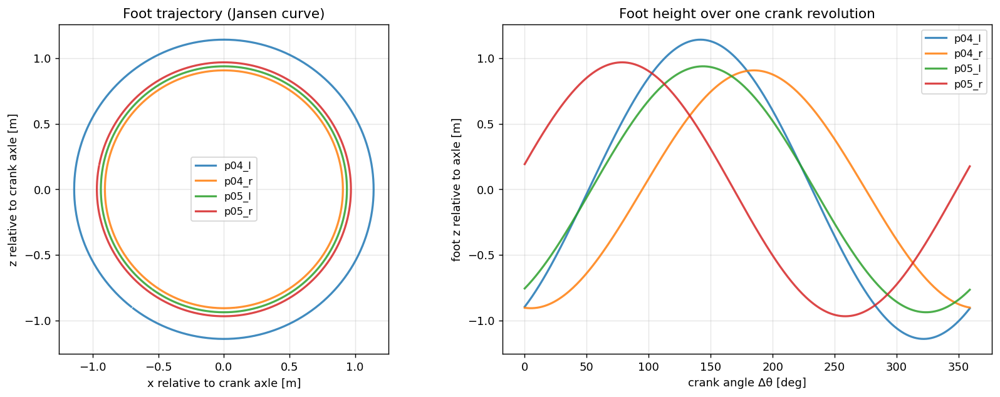
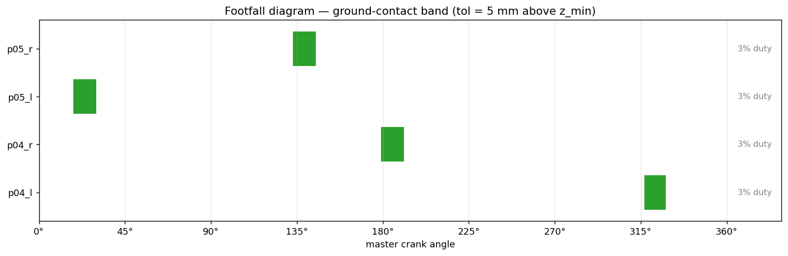

# ME444 G6 Strandbeest (MuJoCo)

This repository contains MuJoCo models and analysis scripts for our multi-leg Strandbeest walker, including a stair-climbing variant.

## Project Report Highlights

### Team

- Farhan Al Zayed
- Shibam Sundar Mahakud
- Tanishk Nath Goswami
- Kushagra Kushwaha

### Abstract (Condensed)

This project studies the Theo Jansen Strandbeest linkage as a kinematic walking mechanism and evaluates stair-climbing modifications. A single-leg model was analyzed for kinematic behavior, and multi-leg assemblies were simulated in MuJoCo for contact-rich locomotion. The modified design increases foot lift by selectively changing five linkage lengths (b, e, g, h, i), improving stair negotiation for specific stair dimensions. Results show successful climbing of early steps, but sensitivity to phase calibration and gait synchronization causes drift and later-step misalignment.

### Mechanism and DOF Notes

Using the planar Gruebler-Kutzbach form:

$$
DOF = 3(n-1) - 2j_1 - j_2
$$

For the single Jansen leg chain used in the report: $n=14$, $j_1=18$, $j_2=0$, giving $DOF=3$. In practical multi-leg operation, shared crankshaft coupling and equality constraints produce effectively single-input coordinated motion.

### Link-Length Changes from Canonical Jansen Ratios

The following links were intentionally modified to reshape the foot path for higher swing clearance:

| Link | Role | Our/Jansen ratio | Status |
|---|---|---:|---|
| b | Upper coupler | 1.344 | Modified |
| e | BDE triangle side | 0.744 | Modified |
| g | Shin chain | 1.335 | Modified |
| h | Shin chain | 0.559 | Modified |
| i | Shin chain | 1.341 | Modified |

All other principal dimensions listed in the report remained at nominal scale (ratio near 1.0).

### Key Findings (From Report)

- Baseline Jansen geometry is highly effective for flat-terrain progression with near-zero stance-phase slip behavior.
- Modified geometry improves vertical clearance and enables early stair-step negotiation.
- Stair-climbing performance is sensitive to linkage proportions, crank phase offsets, and gait synchronization.
- Passive fixed-link kinematics can be tuned for specific stair geometry, but are not inherently adaptive to varying riser/tread dimensions.

## What Is Included

- MuJoCo XML models for single-leg, multi-leg, and climber configurations.
- Interactive simulation runners.
- Trace and gait extraction tools.
- Generated plots, CSV logs, and a recorded stair-climbing video.
- STL assets for geometry/parts.

## Repository Structure

### Core simulation and analysis scripts

- `test.py`: general interactive simulator with closed-chain startup projection and runtime safeguards.
- `tester.py`: convenience runner for the full 12-leg model.
- `sim_stairclimber.py`: interactive stair-climber viewer runner.
- `plot_trace.py`: trace export tool (CSV + PNG, optional live trail viewer).
- `plot_trace2.py`: stair-climber trace/summary plot generator.
- `gait.py`: gait extraction over one crank revolution (curves, footfall, CSV).

### MuJoCo XML models

- `strandbeest_single_leg.xml`
- `strandbeest_4legs_2pairs.xml`
- `strandbeest_6legs_3pairs.xml`
- `strandbeest_12legs.xml`
- `strandbeest_all_legs.xml`
- `strandbeest_climber.xml`

### Generated outputs (already in repo)

- `trace_data.csv`
- `trace_plot.png`
- `strandbeest_traces.png`
- `strandbeest_body_x.png`
- `strandbeest_foot_z.png`
- `strandbeest_gait.csv`
- `strandbeest_gait.png`
- `strandbeest_footfall.png`
- `MuJoCo _ Strandbeest_StairAscending 2026-04-18 09-15-35.mp4`

## Setup

### 1) Python environment

```bash
python3 -m venv .venv
source .venv/bin/activate
```

### 2) Install dependencies

```bash
pip install --upgrade pip
pip install mujoco numpy matplotlib
```

Note: `mujoco.viewer` requires a working OpenGL/display environment for interactive windows.

## Quick Start

### Interactive simulation (all legs)

```bash
python3 tester.py --xml strandbeest_12legs.xml --speed 2.5
```

### Drive or inspect a single leg actuator

```bash
python3 tester.py --xml strandbeest_12legs.xml --speed 2.0 --only-leg p04_l
```

### Stair climber interactive run

```bash
python3 sim_stairclimber.py --xml strandbeest_climber.xml --speed 1.5
```

### Generate trace CSV + PNG from simulation

```bash
python3 plot_trace.py \
  --xml strandbeest_12legs.xml \
  --speed 1.5 \
  --seconds 10 \
  --csv trace_data.csv \
  --out trace_plot.png
```

### Live traces in viewer

```bash
python3 plot_trace.py --xml strandbeest_12legs.xml --live --seconds 20
```

### Stair-climber analysis plots

```bash
python3 plot_trace2.py --xml strandbeest_climber.xml --duration 12 --speed 1.5
```

This writes:

- `strandbeest_traces.png`
- `strandbeest_body_x.png`
- `strandbeest_foot_z.png`

### Gait extraction (one full crank revolution)

```bash
python3 gait.py --xml strandbeest_4legs_2pairs.xml --samples 360
```

This writes:

- `strandbeest_gait.png`
- `strandbeest_footfall.png`
- `strandbeest_gait.csv`

## Results Gallery

### Video

- [Stair-climbing demo (MP4)](MuJoCo%20_%20Strandbeest_StairAscending%202026-04-18%2009-15-35.mp4)

### Plots

#### Trace export plot



#### Stair-climber world-frame foot trajectories



#### Chassis progress over time



#### Foot height over time



#### Gait curve over crank cycle



#### Footfall/contact timing diagram



## Data Files

- `trace_data.csv`: time-series world-frame positions of pivot/pin/knee/foot for discovered legs.
- `strandbeest_gait.csv`: per-leg kinematics over one $2\pi$ crank sweep in axle-relative coordinates.

## Notes

- Many scripts begin by projecting onto a valid closed-chain configuration using `mj_projectConstraint`.
- If an initial state is unstable, scripts include fallback settle/reset logic.
- Use lower speeds first (for example, `--speed 1.0` to `--speed 1.8`) when testing new XML changes.

## Troubleshooting

- Viewer does not open: verify display/OpenGL support and that your environment can launch MuJoCo windows.
- Constraints fail to settle: reduce crank speed and/or increase warm-up steps (`--settle-steps` where supported).
- Missing foot traces: ensure XML naming conventions for feet and crank joints match script expectations.

## References

- Jansen, T. (2007). The great pretender: Linkage mechanism studies. 010 Publishers.
- MuJoCo Physics Engine Documentation (DeepMind): https://mujoco.readthedocs.io/en/stable/
- MSC Adams documentation: https://www.mscsoftware.com/product/adams
- Gruebler, F. (1883). General theory of simple planar kinematic chains.
- Shigley, J. E., and Uicker, J. J. Theory of Machines and Mechanisms.
- Norton, R. L. Design of Machinery.
